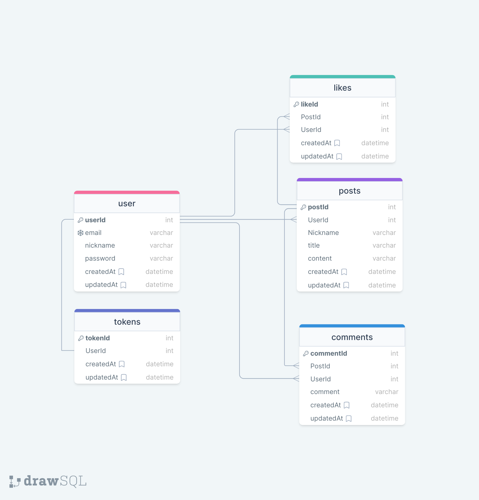

## Node.js 숙련 Lv4 과제

### 필수요구사항

**1. ERD 작성**  
**2. LV.3에서 만든 과제에 댓글, 좋아요 기능 추가**  
**3. 좋아요 게시글 조회, 좋아요 순으로 게시글 정렬**

### API 명세서 링크

https://sh-9403.notion.site/6e2d494e7b52406d854681412d2cfc6e?v=a508fbb992a944a4b81d69b325a74cf2&pvs=4

**ERD**

**1. 댓글 CRUD**

- 게시글 기능과 동일한 로직으로 작성
- 유저의 로그인 토큰을 검사하여 토큰이 유효할 경우 사용가능

**2. 좋아요 기능**

- 댓글과 마찬가지로 토큰을 검사하고 로그인 토큰에 해당하는 사용자만 좋아요 및 취소 가능
- 좋아요를 누른 데이터가 Likes 테이블에 있는 경우 해당 userId 값과 일치하는 데이터를
  삭제하여 좋아요 취소를 구현
- 유저가 좋아요를 누른 게시글 조회를 위해 Posts테이블과 Likes테이블을 join, 이 때 로그인 토큰의 userId와 Likes테이블의 userId가 일치하는 값만 join 하였음.
  이후 Sequelize.literal을 사용하여 Likes테이블의 postId와 Posts테이블의 postsId가 같은 값을 카운트하여 해당 게시글의 전체 좋아요 수를 같이 출력
- 좋아요가 높은 순으로 내림차순 정렬

  <!-- | Path    | API Method | Verify | Description |
  | ------- | ---------- | :----: | ----------- |
  | /signup | POST       |        | 회원가입    | -->
